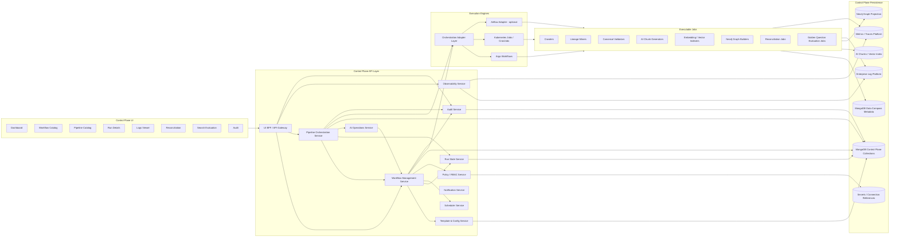
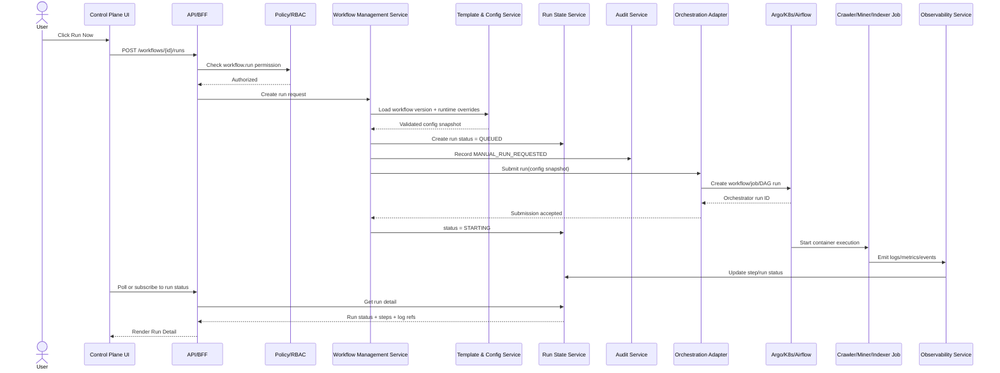
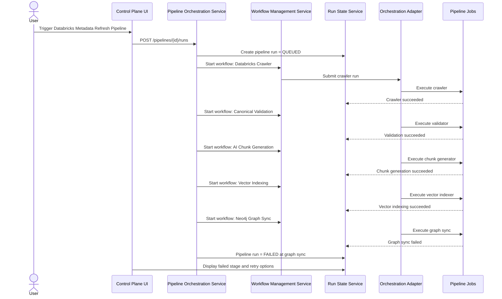

# 02. Production-Grade Target Architecture

## Purpose

This page defines the production-grade target architecture for the Data Compass AI Operations Control Plane.

The architecture has two responsibilities:

1. **Workflow Administration** — manage individual crawler, miner, indexer, graph builder, validation, and evaluation workflows.
2. **Pipeline Operations** — orchestrate end-to-end AI metadata dataflows across MongoDB, vector search, Neo4j, reconciliation, and evaluation.

## Target architecture diagram



## Architecture layers

| Layer | Responsibility |
|---|---|
| Product UI | Operational screens for workflows, pipelines, runs, failures, logs, reconciliation, evaluation, and audit. |
| API/BFF layer | UI-facing APIs, aggregation, pagination, filtering, and presentation-specific view models. |
| Workflow control services | Workflow definitions, templates, config versions, schedules, runs, steps, status, retries, cancellations. |
| Pipeline control services | End-to-end DAG/pipeline composition, dependencies, pipeline runs, and stage-level orchestration. |
| AI operations services | Chunk generation, vector indexing, graph sync, reconciliation, and evaluation workflow control. |
| Persistence | MongoDB collections for templates, definitions, versions, runs, audit, validation, reconciliation, and evaluation results. |
| Execution adapter | Normalizes submission, cancellation, status, retry, and log operations across Argo/Kubernetes/Airflow. |
| Execution engines | Actual container execution through Argo, Kubernetes Jobs/CronJobs, or Airflow. |
| Executable jobs | Crawlers, miners, validators, indexers, graph builders, reconciliation, and evaluation jobs. |
| Observability | Central log platform, metrics, traces, alerts, dashboards. |
| Security/governance | RBAC, policy checks, secrets references, approval workflow, audit events. |

## Authoritative stores and derived projections

| Store | Role | Authoritative? |
|---|---|---:|
| MongoDB Data Compass Metadata | Stores canonical catalog/lineage metadata loaded by crawlers/miners | Yes |
| MongoDB Control Plane Collections | Stores workflow/pipeline definitions, run history, status, audit, validation results | Yes for control-plane metadata |
| AI Chunks / Vector Index | Semantic retrieval projection | No, derived |
| Neo4j Graph Projection | Relationship/lineage traversal projection | No, derived |
| Log Platform | Raw execution logs | Authoritative for logs |
| Metrics/Traces Platform | Metrics, traces, health, latency | Authoritative for observability telemetry |
| Secrets Manager | Secret values and connection material | Authoritative for secrets |

## Manual workflow run interaction



## Pipeline run interaction



## Target pipeline pattern

```text
Platform Metadata Refresh Pipeline
├── 1. Source crawler / miner
├── 2. MongoDB load confirmation
├── 3. Canonical validation
├── 4. Relationship and JRN integrity validation
├── 5. AI chunk generation
├── 6. Vector embedding / index upsert
├── 7. Neo4j graph projection
├── 8. Reconciliation checks
├── 9. Golden-question smoke evaluation
└── 10. Publish pipeline status / notify owners
```

## Deployment topology

| Component | Deployment recommendation |
|---|---|
| Control Plane UI | Web app served behind enterprise authentication. |
| API/BFF | Stateless service, horizontally scalable. |
| Workflow Management Service | Stateless service with MongoDB persistence. |
| Pipeline Orchestration Service | Stateless control service with durable pipeline run state in MongoDB. |
| Scheduler Service | Leader-elected singleton or orchestrator-native scheduler integration. |
| Run State Service | API/service layer over MongoDB state collections. |
| Observability Service | Adapter over enterprise log/metrics/tracing platforms. |
| Orchestration Adapter | Stateless adapter service or library, depending on deployment model. |
| Jobs | Containerized crawlers/miners/indexers/validators/graph builders. |

## Production-grade requirements

| Area | Requirement |
|---|---|
| Availability | Jobs should continue even if UI is temporarily unavailable. |
| Durability | Run records, config versions, audit events, and output summaries must be durable. |
| Reproducibility | Every run references exact workflow version, image tag, config snapshot, and overrides. |
| Security | RBAC and secrets controls are enforced in APIs, not only UI. |
| Audit | Production changes and manual production runs require audit evidence. |
| Observability | Logs, metrics, traces, output counts, and failure classifications are correlated by run ID. |
| Scalability | Workflow definitions, run history, and logs are paginated and indexed. |
| Extensibility | New connectors and jobs are onboarded through templates and config schemas. |
| Portability | Execution is decoupled from one orchestrator through adapters. |

## Orchestrator recommendation

| Engine | Best use | Recommendation |
|---|---|---|
| Kubernetes Jobs/CronJobs | Simple container execution and scheduling | Good for MVP if simple. |
| Argo Workflows | Kubernetes-native DAGs, steps, retries, UI-friendly workflow execution | Best strategic fit if Kubernetes-native. |
| Airflow | Data engineering DAGs, mature scheduling, dependencies | Useful if enterprise has strong Airflow standard. |

Recommended path:

1. Implement adapter abstraction first.
2. Use Argo Workflows if available and acceptable.
3. Use Kubernetes Jobs as a fallback MVP adapter.
4. Add Airflow adapter later only if required.
