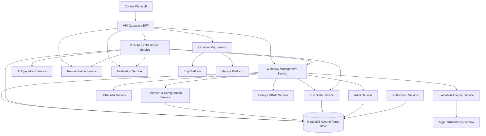

# 04. Component Architecture and Responsibilities

## Purpose

This page defines the main architecture components, their responsibilities, boundaries, and ownership.

## Component map



## Component responsibilities

| Component | Responsibilities | Non-responsibilities |
|---|---|---|
| Control Plane UI | Product screens, forms, run views, logs, dashboards, audit views | Direct orchestrator calls, secret handling, security enforcement by itself |
| API Gateway / BFF | UI-optimized APIs, aggregation, pagination, response shaping | Business rules that belong in domain services |
| Workflow Management Service | Workflow lifecycle, runs, retry, cancel, schedule linkage, audit calls | Executing containers directly |
| Pipeline Orchestration Service | Pipeline DAGs, pipeline runs, dependencies, stage retry | Implementing crawler/miner logic |
| Template & Config Service | Templates, JSON schemas, validation, version diff, rollback | Persisting raw secrets |
| Run State Service | Normalized run/step status, output summaries, failure details | Raw log storage |
| Scheduler Service | Schedules, missed schedules, overlap policies | Long-running job execution |
| Execution Adapter Service | Submit/cancel/status/log-ref against Argo/K8s/Airflow | UI rendering or configuration decisions |
| Observability Service | Logs, metrics, traces, failure classification | Replacing enterprise log platform |
| AI Operations Service | Chunk/vector/graph templates, freshness, AI pipeline job coordination | Serving end-user chat/search |
| Reconciliation Service | Count and integrity checks across source/Mongo/vector/graph | Correcting source data automatically |
| Evaluation Service | Golden-question runs and quality metrics | Deciding business relevance without human review |
| Policy/RBAC Service | Permission decisions, environment controls, log access rules | UI-only visibility control |
| Audit Service | Audit event recording and querying | Storing raw logs |
| Notification Service | Failure/SLA/evaluation notifications | Incident management replacement |

## Component ownership recommendation

| Component | Suggested owner |
|---|---|
| UI / BFF | Product engineering / UI team |
| Workflow Management Service | Data Compass platform engineering |
| Pipeline Orchestration Service | Data Compass platform engineering |
| Orchestration Adapter | Platform/SRE with Data Compass input |
| AI Operations Service | Data Compass AI/search team |
| Reconciliation and Evaluation | Data Compass quality/governance team with AI team |
| RBAC/Audit | Security/platform governance |
| Observability | SRE/operations |

## Design boundary

The core architectural boundary is:

```text
UI → Control Plane APIs → Orchestration Adapter → Execution Engine → Jobs
```

Not:

```text
UI → Kubernetes/Airflow directly
```

This boundary gives the platform validation, versioning, audit, RBAC, and portability.
