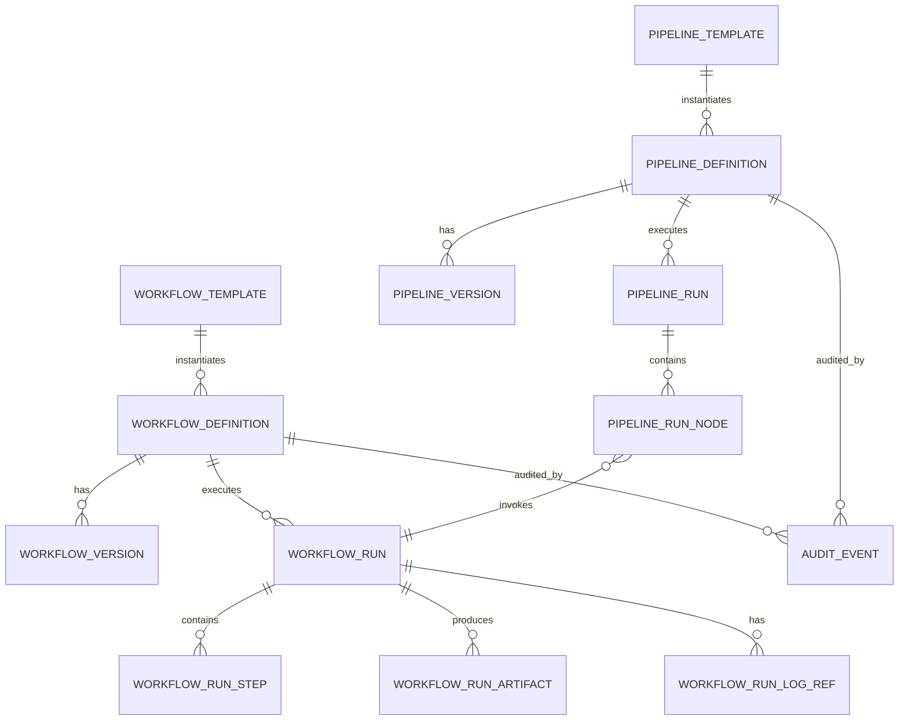
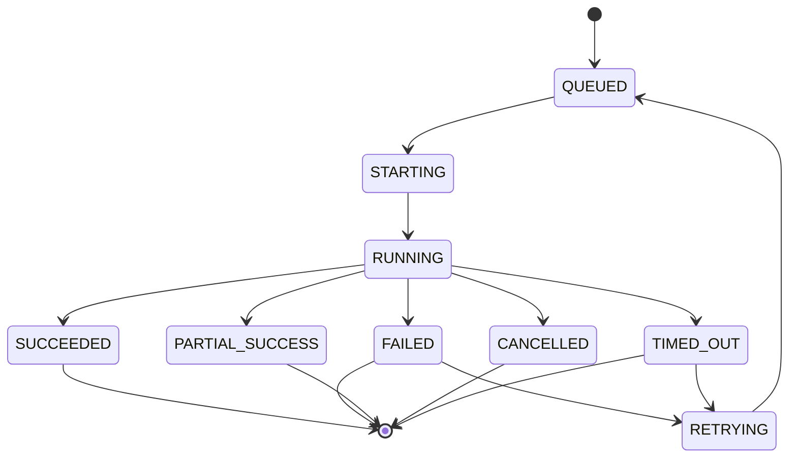

# 05. Data Model and State Management

## Purpose

This page defines the control-plane MongoDB data model and normalized state model.

## Core collections

```text
workflow_templates
workflow_definitions
workflow_versions
workflow_schedules
workflow_runs
workflow_run_steps
workflow_run_artifacts
workflow_run_log_refs
pipeline_templates
pipeline_definitions
pipeline_versions
pipeline_runs
pipeline_run_nodes
config_validation_results
connection_references
scheduler_events
reconciliation_runs
reconciliation_results
evaluation_sets
evaluation_runs
evaluation_results
audit_events
notification_events
approval_requests
workflow_locks
```

## Entity relationship overview



## Workflow template example

```json
{
  "templateId": "tmpl_databricks_crawler",
  "name": "Databricks Metadata Crawler",
  "type": "CRAWLER",
  "platform": "DATABRICKS",
  "status": "ACTIVE",
  "image": "data-compass/databricks-crawler:1.8.2",
  "entrypoint": ["python", "crawler.py"],
  "configSchema": {},
  "defaultConfig": {},
  "allowedRuntimeOverrides": ["catalogs", "schemas", "tables", "logLevel", "runMode"],
  "defaultResourceProfile": {"cpu": "2", "memory": "4Gi", "timeoutMinutes": 120},
  "expectedOutputs": ["Distribution", "Dataset", "DataModelEntity", "DataModelAttribute"],
  "supportedOrchestrators": ["ARGO", "KUBERNETES_JOB"]
}
```

## Workflow definition example

```json
{
  "workflowId": "wf_databricks_prod_crawler",
  "templateId": "tmpl_databricks_crawler",
  "name": "Databricks PROD Metadata Crawler",
  "type": "CRAWLER",
  "platform": "DATABRICKS",
  "environment": "PROD",
  "status": "ACTIVE",
  "ownerTeam": "Data Compass Platform",
  "currentVersion": 7,
  "scheduleId": "sch_databricks_prod_daily",
  "connectionRefs": ["conn_databricks_prod"],
  "tags": ["mvp", "prod", "databricks"]
}
```

## Workflow version example

```json
{
  "workflowId": "wf_databricks_prod_crawler",
  "version": 7,
  "configSnapshot": {
    "workspace": "prod-workspace",
    "catalogs": ["risk", "finance"],
    "schemas": ["*"],
    "includeTables": true,
    "includeViews": true,
    "includeColumns": true,
    "excludePatterns": ["tmp_*", "test_*"],
    "targetMongoDatabase": "data_compass_prod"
  },
  "resourceProfileSnapshot": {"cpu": "2", "memory": "4Gi", "timeoutMinutes": 120},
  "scheduleSnapshot": {"type": "CRON", "cron": "0 2 * * *", "timezone": "America/Chicago"},
  "imageSnapshot": "data-compass/databricks-crawler:1.8.2",
  "changeReason": "Add finance catalog to production crawl scope.",
  "createdBy": "sid456",
  "approvalStatus": "APPROVED"
}
```

## Workflow run example

```json
{
  "runId": "run_20260607_001",
  "workflowId": "wf_databricks_prod_crawler",
  "workflowVersion": 7,
  "pipelineRunId": null,
  "status": "FAILED",
  "triggerType": "MANUAL",
  "triggeredBy": "sid123",
  "triggerReason": "Manual validation after config change.",
  "runtimeOverrides": {"runMode": "INCREMENTAL", "logLevel": "DEBUG"},
  "orchestrator": "ARGO",
  "orchestratorRunId": "argo/databricks-prod-crawler-abc123",
  "summary": {
    "recordsRead": 12500,
    "recordsWritten": 812,
    "assetsCreated": 214,
    "assetsUpdated": 812,
    "assetsDeprecated": 11,
    "lineageEdgesCreated": 0,
    "errorCount": 3
  },
  "failure": {
    "stage": "EXTRACT_TABLES",
    "errorCode": "DATABRICKS_AUTH_FAILURE",
    "message": "OAuth token expired.",
    "retryable": true,
    "recommendedAction": "Validate Databricks connection reference."
  }
}
```

## Pipeline version example

```json
{
  "pipelineId": "pipe_databricks_prod_metadata_refresh",
  "version": 3,
  "nodes": [
    {"nodeId": "crawler", "workflowId": "wf_databricks_prod_crawler", "dependsOn": []},
    {"nodeId": "validator", "workflowId": "wf_canonical_validation", "dependsOn": ["crawler"]},
    {"nodeId": "chunker", "workflowId": "wf_ai_chunk_generation", "dependsOn": ["validator"]},
    {"nodeId": "vector", "workflowId": "wf_vector_indexing", "dependsOn": ["chunker"]},
    {"nodeId": "graph", "workflowId": "wf_neo4j_graph_sync", "dependsOn": ["validator"]},
    {"nodeId": "reconciliation", "workflowId": "wf_reconciliation", "dependsOn": ["vector", "graph"]},
    {"nodeId": "evaluation", "workflowId": "wf_golden_question_smoke", "dependsOn": ["reconciliation"]}
  ],
  "failurePolicy": "STOP_ON_FAILURE"
}
```

## Normalized statuses

### Workflow definition status

| Status | Meaning |
|---|---|
| DRAFT | Created but not active. |
| ACTIVE | Can be scheduled or manually run. |
| DISABLED | Cannot be scheduled; manual run may be restricted. |
| ARCHIVED | Hidden from normal operations. |

### Run status

| Status | Meaning |
|---|---|
| QUEUED | Run record created but not submitted. |
| STARTING | Submitted to orchestrator. |
| RUNNING | Execution is active. |
| SUCCEEDED | Completed successfully. |
| FAILED | Completed with failure. |
| PARTIAL_SUCCESS | Completed with warnings or non-critical failures. |
| CANCELLED | Cancelled by user/system. |
| TIMED_OUT | Exceeded timeout. |
| RETRYING | Retry has been requested or is running. |
| SKIPPED | Skipped due to dependency or policy. |

## Run state transitions



## Indexing and retention guidance

| Collection | Recommended indexes |
|---|---|
| workflow_definitions | workflowId, status, platform, environment, ownerTeam, templateId |
| workflow_versions | workflowId + version unique |
| workflow_runs | runId, workflowId, status, startedAt, triggeredBy, environment |
| workflow_run_steps | runId + stepId unique, status, stepType |
| pipeline_runs | pipelineRunId, pipelineId, status, startedAt |
| audit_events | actor, action, workflowId, pipelineId, timestamp |
| reconciliation_results | runId, entityType, checkType, status |
| evaluation_results | evaluationRunId, questionId, status, metric |

Retention recommendation:

- Keep run summaries long-term.
- Keep step summaries long-term.
- Keep raw logs in log platform according to enterprise retention policy.
- Keep audit events according to compliance requirements.
- Archive old run records if volume becomes large.
