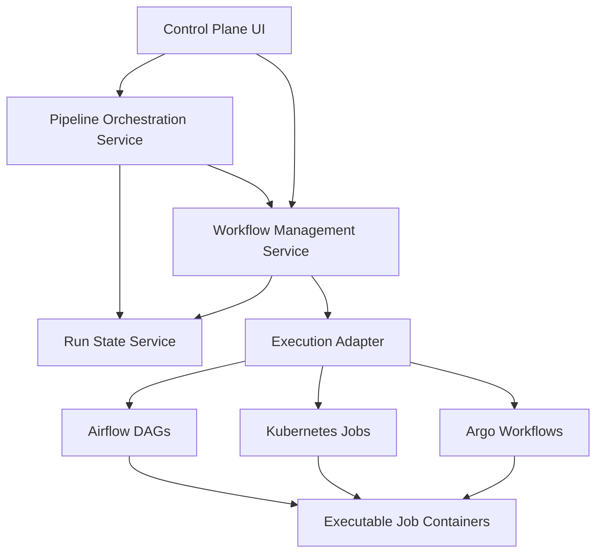

# 08. Workflow and Pipeline Orchestration Design

## Purpose

This page defines the orchestration design for individual workflows and end-to-end pipelines.

## Core distinction

### Workflow

A workflow is one executable unit.

Examples:

- Databricks metadata crawler
- Snowflake lineage miner
- Canonical validation job
- AI chunk generation job
- Vector reindex job
- Neo4j graph sync job
- Reconciliation job
- Golden-question evaluation job

### Pipeline

A pipeline is a composed dataflow of multiple workflows with dependencies.

Example:

```text
Snowflake Metadata + AI Refresh Pipeline
→ Snowflake metadata crawler
→ Snowflake lineage miner
→ Canonical validation
→ AI chunk generation
→ Vector indexing
→ Neo4j graph sync
→ Reconciliation
→ Golden-question smoke evaluation
```

## Orchestration architecture



## Workflow execution lifecycle

1. User, scheduler, or pipeline requests a run.
2. Workflow Management Service checks permissions.
3. Workflow version and config snapshot are loaded.
4. Runtime overrides are validated.
5. Run record is created with status `QUEUED`.
6. Orchestration adapter submits execution.
7. Run status moves to `STARTING`, then `RUNNING`.
8. Job emits logs, metrics, and step events.
9. Run State Service updates run and step status.
10. Run completes as `SUCCEEDED`, `FAILED`, `PARTIAL_SUCCESS`, `CANCELLED`, or `TIMED_OUT`.
11. Audit and notifications are emitted.

## Pipeline execution lifecycle

1. User or schedule starts pipeline.
2. Pipeline version/DAG snapshot is loaded.
3. Pipeline run record is created.
4. Root workflow nodes are submitted.
5. Completed nodes unlock dependent nodes.
6. Failure policy determines whether pipeline stops, skips optional nodes, or continues.
7. Pipeline status is updated based on node statuses.
8. Pipeline-level summary and evidence are stored.

## Pipeline dependency policies

| Policy | Meaning |
|---|---|
| STOP_ON_FAILURE | Stop pipeline when any required node fails. |
| CONTINUE_ON_OPTIONAL_FAILURE | Continue if optional node fails. |
| MANUAL_DECISION | Pause and ask operator to continue, retry, or abort. |
| ALWAYS_RUN_CLEANUP | Run cleanup/finalization regardless of failure. |

## Retry strategy

Workflow retry modes:

- Retry entire run.
- Retry failed step, if supported.
- Rerun with same config snapshot.
- Rerun with current config version.
- Rerun with runtime overrides.

Pipeline retry modes:

- Retry failed node only.
- Retry failed node and downstream nodes.
- Retry entire pipeline.
- Skip optional failed node.

## Overlap control

| Policy | Behavior |
|---|---|
| ALLOW_OVERLAP | Multiple runs can execute simultaneously. |
| BLOCK_OVERLAP | New run blocked if one is already running. |
| CANCEL_PREVIOUS | Cancel existing run and start new one. |
| QUEUE_NEXT | Queue new run until active run completes. |

Default recommendation:

- Production crawlers/miners: `BLOCK_OVERLAP`
- Reindex jobs: `QUEUE_NEXT`
- Evaluation jobs: `ALLOW_OVERLAP` only for different scopes

## Orchestrator adapter pattern

The control plane should use an adapter interface so it can support Argo, Kubernetes Jobs, and Airflow without rewriting UI and workflow APIs.

Adapter responsibilities:

- Submit run
- Cancel run
- Get status
- Get steps
- Get logs reference
- Normalize errors
- Map orchestrator labels/annotations to run IDs

## Recommended sequencing

1. Build adapter interface.
2. Implement one adapter first: Argo preferred, Kubernetes Job acceptable.
3. Make workflow runs work end-to-end.
4. Add pipeline orchestration on top of workflow runs.
5. Add additional execution adapters only when needed.
