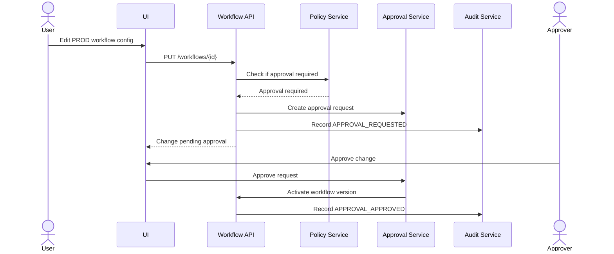

# 11. Security, RBAC, Audit, and Governance

## Purpose

This page defines the security and governance model for the control plane.

## Security principles

1. Enforce permissions in backend APIs, not only the UI.
2. Never store raw secrets in workflow definitions.
3. Production actions require stronger controls than lower environments.
4. Log access is permissioned because logs may contain sensitive metadata.
5. Every meaningful action emits an audit event.
6. Manual production runs require a reason.
7. Configuration versions and approvals are retained.

## Roles

| Role | Description |
|---|---|
| Platform Admin | Full admin for templates, settings, execution backends, and production operations. |
| Workflow Admin | Create/edit workflows and schedules within assigned scope. |
| Pipeline Admin | Create/edit pipelines and pipeline schedules. |
| Metadata Operator | Monitor runs, retry failures, cancel runs, inspect logs. |
| Data Platform Owner | View and trigger workflows for owned platforms/sources. |
| Read-only Viewer | View workflow/pipeline status and run history. |
| Auditor | View audit history and evidence. |
| Approver | Approve production config or schedule changes. |

## Permissions

```text
workflow.view
workflow.create
workflow.edit
workflow.archive
workflow.enable_disable
workflow.run
workflow.run_prod
workflow.retry
workflow.cancel
workflow.view_logs
workflow.view_config
workflow.view_versions
workflow.rollback
workflow.approve_change
pipeline.view
pipeline.create
pipeline.edit
pipeline.run
pipeline.retry_stage
pipeline.cancel
pipeline.approve_change
template.view
template.create
template.edit
connection.view
connection.test
connection.manage
audit.view
reconciliation.view
reconciliation.run
evaluation.view
evaluation.run
admin.manage_settings
```

## Environment-based controls

| Environment | Control recommendation |
|---|---|
| DEV | Broad edit/run permissions. |
| UAT | Edit/run permissions limited to workflow admins and operators. |
| PROD | Strong RBAC, reason required, approvals for critical changes, full audit. |

## Secret handling

Workflow definitions store only references:

```json
{
  "connectionRefs": ["conn_databricks_prod"]
}
```

Rules:

- Do not expose secret values in UI.
- Do not store raw secret values in MongoDB.
- Do not include secrets in logs.
- Mask connection-sensitive fields.
- Audit connection reference changes.

## Audit events

Audit these actions:

- Workflow created.
- Workflow config changed.
- Workflow schedule changed.
- Workflow enabled/disabled.
- Workflow archived.
- Workflow manually triggered.
- Workflow retried.
- Workflow cancelled.
- Pipeline created/changed.
- Pipeline triggered/retried/cancelled.
- Production run triggered.
- Approval requested/approved/rejected.
- Connection reference changed.
- Template changed.
- Sensitive logs viewed, if required by policy.

## Production approval flow



## Pitfalls

| Pitfall | Mitigation |
|---|---|
| UI-only permissions | Enforce in backend APIs. |
| Raw secrets in config | Store only secret references. |
| Sensitive logs exposed | Permission log access and redact values. |
| Production changes unaudited | Require reason and audit event. |
| Retry/cancel abuse | Permission-gate and audit these actions. |
| Approval bypass | Enforce approval in API before activation. |
