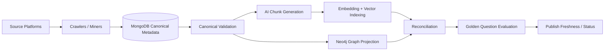

# 12. AI Pipeline Operations, Reconciliation, and Evaluation

## Purpose

This page defines how the control plane manages the full Data Compass AI metadata pipeline beyond crawler/miner execution.

## End-to-end AI metadata pipeline



## AI operations workflows

### Canonical validation

Checks:

- Required fields present.
- JRN exists and is stable.
- GUID exists.
- Lifecycle status valid.
- Node references valid.
- Owner fields valid.
- Relationship references resolvable.
- Classification fields valid.
- Duplicate keys absent.

### AI chunk generation

Chunk types:

- Distribution summary
- Dataset summary
- Attribute summary
- DataService summary
- DataFlow lineage summary
- DataProcess transformation summary
- Report dependency summary
- Classification summary

### Vector indexing

Modes:

- Full reindex
- Incremental reindex
- Reindex by entity type
- Reindex by source JRN
- Reindex failed chunks
- Embedding model migration

### Neo4j graph projection

Modes:

- Full graph rebuild
- Incremental graph sync
- Relationship-only sync
- Lineage-only sync
- Graph schema validation
- Graph count reconciliation

### Reconciliation

| Check | Example |
|---|---|
| Source to MongoDB | Source tables count equals Distribution count by scope. |
| MongoDB to chunks | Every searchable entity has expected chunks. |
| Chunks to vector | Every active chunk has vector record. |
| MongoDB to Neo4j nodes | Every active Distribution has graph node. |
| MongoDB relationships to Neo4j edges | Every DataFlow has expected graph edges. |
| Deprecated cleanup | Deprecated assets excluded/deactivated in vector and graph. |
| JRN integrity | No missing or duplicate JRNs in MVP scope. |
| Orphan relationships | No dangling references beyond accepted threshold. |

### Evaluation

Evaluation types:

- Exact lookup tests
- Semantic search top-K tests
- Lineage traversal tests
- Citation coverage tests
- Restricted retrieval tests
- Missing metadata behavior tests
- Ambiguous entity resolution tests

## AI pipeline dashboard

```text
Source Crawl       ✓ Success
MongoDB Load       ✓ Success
Validation         ⚠ 12 warnings
Chunk Generation   ✓ Success
Vector Indexing    ✓ Success
Graph Projection   ✗ Failed
Reconciliation     Not run
Search Evaluation  Not run
```

## Freshness model

| Layer | Freshness source |
|---|---|
| Source crawl | Last successful crawler/miner run |
| MongoDB metadata | Last successful load timestamp |
| Validation | Last successful validation run |
| AI chunks | Last successful chunk generation timestamp |
| Vector index | Last successful vector upsert timestamp |
| Neo4j graph | Last successful graph sync timestamp |
| Reconciliation | Last reconciliation run timestamp |
| Evaluation | Last golden-question run timestamp |

## Reconciliation result shape

```json
{
  "reconciliationRunId": "recon_123",
  "scope": {"platform": "DATABRICKS", "environment": "PROD", "entityType": "Distribution"},
  "checks": [
    {
      "checkType": "MONGODB_TO_VECTOR_COUNT",
      "expected": 120000,
      "actual": 119980,
      "difference": 20,
      "status": "FAILED",
      "detailsRef": "recon_details_456"
    }
  ],
  "status": "FAILED"
}
```

## Evaluation result shape

```json
{
  "evaluationRunId": "eval_123",
  "questionSetId": "golden_smoke_v1",
  "status": "COMPLETED",
  "metrics": {
    "questionsTotal": 50,
    "passed": 43,
    "failed": 7,
    "top1Accuracy": 0.72,
    "top5Accuracy": 0.86,
    "citationCoverage": 0.96,
    "restrictedRetrievalPassRate": 1.0
  }
}
```

## Operational rules

1. Vector indexing should not proceed if canonical validation fails critical checks.
2. Graph sync should not proceed if relationship integrity has critical failures.
3. Search evaluation should run after vector or graph refresh.
4. Reconciliation mismatches above threshold should create warnings or failures.
5. Production index/graph rebuilds should be versioned and auditable.
6. Golden-question regressions should notify search/product owners.
